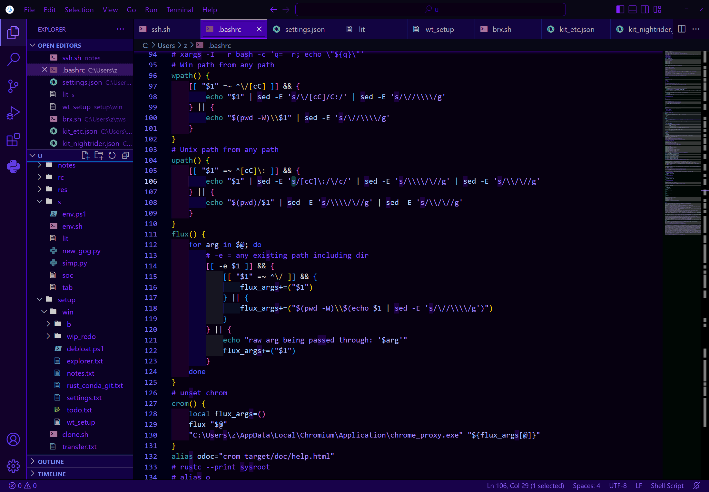

## VSCode theme from scratch

[snip_theme.png](kit-nightrider-theme-screenshot)



Documentation for a pure settings/json based theme is shallow so here are my from
scratch confs if you care to do something similar it's possibly a good baseline.  
Typically coding at night the color sceme is softened particularly.  
I also switched some red to orange to decrease alert-mood-modulations.

[kit_nightrider.json](kit_nightrider.json)  
Easy to copy/paste and union with your current settings

I've also included a bare min quality of life settings.json  
I don't use a base theme, but you prob should since you  
likely use features I don't like integrated terminal.  
I also reccomend `"window.commandCenter": true,` I didn't know it existed.  
[kit_etc.json](kit_etc.json)

My [keybindings.json](keybindings.json) setup is included  
mostly to refer you to these two settings:

```
[
	// Color customization inspector!
	{
		"key": "ctrl+shift+- k",
		"command": "editor.action.inspectTMScopes"
	},
	{
		"key": "ctrl+shift+- shift+k",
		"command": "editor.action.inspectTMScopes"
	}
]
```

They give a breadcrumb to the scope for customizing the textMateRules you can use.  
My keybindings usually dub shift since i use a hold shift mechanical kb.

## OVERWRITE script

Running this script will overwrite the config files in your vsconfig user directory. The settings.json file will be backed up if a backup does not exist, both keybinding.json and settings.json will be overwritten.

```
bash ./sample_overwrite.sh
```

## Extensions-Theme

[file-icons](https://marketplace.visualstudio.com/items?itemName=file-icons.file-icons)  
[indent-rainbow](https://marketplace.visualstudio.com/items?itemName=oderwat.indent-rainbow)

Including some more recomendations for any beginner thats stumbled by.

## Recomended-formatter

```settings.json
    "editor.formatOnSave": true,
	"editor.defaultFormatter": "esbenp.prettier-vscode",
	"[shellscript]": {
		"editor.defaultFormatter": "foxundermoon.shell-format"
	},
	"[ignore]": {
		"editor.defaultFormatter": "foxundermoon.shell-format"
	},
	"[dotenv]": {
		"editor.defaultFormatter": "foxundermoon.shell-format"
	},
```

[prettier](https://marketplace.visualstudio.com/items?itemName=esbenp.prettier-vscode)  
To enable prettier extendables put a package.json at project root  
then npm install relevant extensions and also the vsix like  
[prettier-rust or which-ever](https://marketplace.visualstudio.com/items?itemName=jinxdash.prettier-rust)

## Analyzer is recomended such as

[rust-analyzer](https://marketplace.visualstudio.com/items?itemName=rust-lang.rust-analyzer)  
[shell-format](https://marketplace.visualstudio.com/items?itemName=foxundermoon.shell-format)
[ms-python](https://marketplace.visualstudio.com/items?itemName=ms-python.python)
